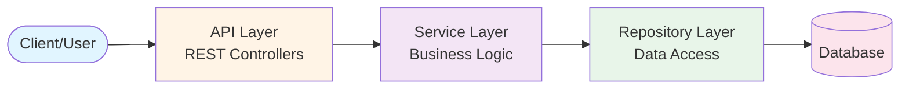
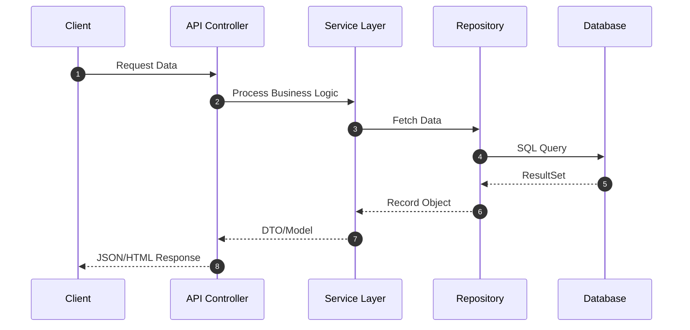

# Architecture Decision Record (ADR)

## 프로젝트: adr-analysis-11858103529739224129

**생성일시:** 2026-02-25 07:31:10

**분석 도구:** ADR Generator v1.0

---

## 1. 📋 개요

본 문서는 소스코드 분석을 통해 자동으로 생성된 Architecture Decision Record입니다.

### 프로젝트 언어 구성

| 언어 | 파일 수 | 비율 |
|------|---------|------|
| Ruby | 819 | 59.5% |
| JavaScript | 13 | 0.9% |
| TypeScript | 545 | 39.6% |

### 프로젝트 통계

| 항목 | 수량 |
|------|------|
| 총 소스 파일 | 1377 |
| 클래스/인터페이스/타입 | 2562 |
| 패키지/네임스페이스/모듈 | 43 |
| 논리적 모듈 | 43 |
| API 엔드포인트 | 108 |
| 데이터베이스 테이블 | 62 |

## 2. 🎯 핵심 의사결정 (ADR-E)

### 의사결정

**결정:** 다중 언어 기반 RESTful API 중심 Ruby Logger 기반 아키텍처 채택

**근거:** 장기적인 유지보수성, 확장성, 팀 협업을 위한 명확한 아키텍처 정의 필요

**영향받는 이해관계자:**
- 개발팀 - 구현 및 코드 작성
- 프론트엔드팀 - API 통합
- 데이터팀 - 데이터베이스 관리
- 운영팀 - 배포 및 모니터링

## 3. 🔄 고려된 대안 (ADR-E)

### ✅ 선택된 옵션: Ruby on Rails

**설명:** 풀스택 Ruby 웹 프레임워크

**장점:**
- Convention over Configuration으로 빠른 개발
- ActiveRecord ORM 내장
- 풍부한 gem 생태계
- MVC 아키텍처 표준화
- Rails 커뮤니티와 방대한 문서

**단점:**
- 모놀리식 구조로 마이크로서비스 전환 어려움
- 성능이 Go/Node.js 대비 낮음
- 메모리 사용량 높음
- Ruby 버전 관리 복잡성

**선택 이유:** 빠른 개발 속도와 풍부한 생태계, 스타트업과 중소 규모 프로젝트에 최적

### ❌ 거부된 대안들

#### Sinatra

**설명:** 경량 Ruby 웹 프레임워크

**장점:**
- 매우 가볍고 빠름
- 유연한 구조
- 마이크로서비스에 적합
- 학습 곡선 낮음

**단점:**
- Rails 대비 기능 부족
- 대규모 프로젝트에 구조화 어려움
- ORM 별도 설정 필요

**거부 이유:** Rails의 풍부한 기능과 생산성을 우선시

#### Hanami

**설명:** 현대적 Ruby 웹 프레임워크

**장점:**
- 클린 아키텍처 지향
- Rails 대비 낮은 메모리 사용
- 명시적 설계

**단점:**
- 작은 커뮤니티
- gem 호환성 제한
- Rails 대비 적은 학습 자료

**거부 이유:** Rails의 성숙한 생태계와 팀 경험을 우선시

#### Minitest

**설명:** Ruby 표준 라이브러리 테스트 프레임워크

**장점:**
- Ruby 표준 라이브러리 포함
- 빠른 실행 속도
- 단순한 구조

**단점:**
- RSpec 대비 표현력 부족
- BDD 스타일 제한적

**거부 이유:** RSpec의 표현력과 Rails 통합을 우선시

#### Rodauth

**설명:** Ruby 인증 프레임워크

**장점:**
- 높은 보안성
- Rails/Sinatra 모두 지원
- 명시적 설계

**단점:**
- Devise 대비 작은 커뮤니티
- 학습 자료 부족

**거부 이유:** Devise의 풍부한 생태계와 팀 경험을 우선시

#### Vue.js

**설명:** 프로그레시브 프레임워크

**장점:**
- 쉬운 학습 곡선
- 공식 라우터/상태관리
- 좋은 문서화

**단점:**
- React 대비 작은 생태계
- 엔터프라이즈 채택률 낮음

**거부 이유:** 팀의 React 경험과 생태계 크기를 우선시

#### Vue.js

**설명:** 프로그레시브 프레임워크

**장점:**
- 쉬운 학습 곡선
- 공식 라우터/상태관리
- 좋은 문서화

**단점:**
- React 대비 작은 생태계
- 엔터프라이즈 채택률 낮음

**거부 이유:** 팀의 React 경험과 생태계 크기를 우선시

#### GraphQL

**설명:** 쿼리 언어 기반 API

**장점:**
- 정확한 데이터 요청
- 단일 엔드포인트
- 강력한 타입 시스템

**단점:**
- 복잡도 증가
- 캐싱 어려움
- 학습 곡선

**거부 이유:** 현재 요구사항에서는 REST의 단순함이 더 적합

## 4. 📝 구조화된 설명 - 5W1H (ADR-E)

### 🤔 Why (왜)

**문제:** 프로젝트 아키텍처 구조화 및 문서화 필요

**동기:** 장기적인 유지보수성, 확장성, 팀 협업을 위한 명확한 아키텍처 정의 필요

**목표:**
- 명확하고 추적 가능한 아키텍처 구조 확립
- 팀 간 일관된 이해와 커뮤니케이션 촉진
- 기술 부채 최소화 및 품질 속성 보장

### 📋 What (무엇을)

**결정 내용:** 다중 언어 기반 RESTful API 중심 Ruby Logger 기반 아키텍처 채택

**범위:** 전체 프로젝트 (1377개 파일, 2562개 클래스)

### ⚖️ What-if (만약)

**트레이드오프:**
- 프레임워크 의존성 증가 vs 개발 생산성 향상
- 학습 곡선 vs 표준화된 패턴
- 다중 언어 복잡도 vs 각 언어의 강점 활용

**예상 결과:**
- 개발 생산성 향상
- 코드 품질 및 일관성 개선
- 유지보수 비용 감소

### 👥 Who (누가)

**의사결정자:** 아키텍처 팀 / 기술 리더

**영향받는 팀:**
- 개발팀 - 구현 및 코드 작성
- 프론트엔드팀 - API 통합
- 데이터팀 - 데이터베이스 관리
- 운영팀 - 배포 및 모니터링

**책임자:** 아키텍처 팀

### 📍 Where (어디서)

**적용 범위:** 모듈: PinBindings, WebcamFeeds, Telemetries, 외 40개

**경계:** 레거시 시스템과의 통합 인터페이스는 별도 검토 필요

### ⏰ When (언제)

**유효 기간:** 프로젝트 전체 생명주기 (단, 주요 기술 스택 변경 시 재검토)

**재검토 일정:** 분기별 아키텍처 리뷰 또는 주요 요구사항 변경 시

**의존성:**
- 선택된 프레임워크 버전 호환성
- 다중 언어 빌드 환경 구성

## 5. 🏗️ 아키텍처 결정사항

### 2.1 아키텍처 스타일

**결정:** RESTful API 기반 아키텍처

**설명:** HTTP 프로토콜을 통한 RESTful API를 제공하는 아키텍처입니다.

**장점:** 클라이언트-서버 분리, 확장성, 플랫폼 독립성

**고려사항:** API 버저닝, 인증/인가, 에러 핸들링

### 2.2 계층 구조

**결정:** 3-Tier 계층형 아키텍처

- **Presentation Layer:** API Controllers
- **Business Logic Layer:** Service Layer
- **Data Access Layer:** Repository Layer

**근거:** 명확한 관심사의 분리와 유지보수성 향상

## 6. 📦 모듈 구조

| 모듈명 | 패키지 | 클래스 수 |
|--------|---------|----------|
| PinBindings | PinBindings | 1 |
| WebcamFeeds | WebcamFeeds | 1 |
| Telemetries | Telemetries | 1 |
| Mgmt | Mgmt | 1 |
| ConfigHelpers | ConfigHelpers | 1 |
| SensorReadings | SensorReadings | 1 |
| LogDeliveryStuff | LogDeliveryStuff | 1 |
| Users | Users | 1 |
| Devices | Devices | 1 |
| SavedGardens | SavedGardens | 1 |
| Releases | Releases | 1 |
| Points | Points | 1 |
| FarmwareInstallations | FarmwareInstallations | 1 |
| Auth | Auth | 1 |
| root | root | 1 |
| Folders | Folders | 1 |
| Sensors | Sensors | 1 |
| Regimens | Regimens | 1 |
| Mutations | Mutations | 1 |
| FarmBot | FarmBot | 1 |
| Sequences | Sequences | 1 |
| CeleryScriptSettingsBag | CeleryScriptSettingsBag | 1 |
| Helpers | Helpers | 1 |
| Images | Images | 1 |
| Tools | Tools | 1 |
| Fragments | Fragments | 1 |
| PasswordResets | PasswordResets | 1 |
| FarmwareEnvs | FarmwareEnvs | 1 |
| Peripherals | Peripherals | 1 |
| Logs | Logs | 1 |
| PlantTemplates | PlantTemplates | 1 |
| ReleaseTask | ReleaseTask | 1 |
| FbosDetector | FbosDetector | 1 |
| Errors | Errors | 1 |
| FarmEvents | FarmEvents | 1 |
| Configs | Configs | 1 |
| PinBindingSpecHelper | PinBindingSpecHelper | 1 |
| CeleryScript | CeleryScript | 1 |
| Alerts | Alerts | 1 |
| Resources | Resources | 1 |
| Api | Api | 1 |
| PointGroups | PointGroups | 1 |
| Curves | Curves | 1 |

## 7. 🛠️ 기술 스택

### 사용된 프레임워크 및 라이브러리

**로깅**
- Ruby Logger

**데이터 접근**
- ActiveRecord (ORM)

**기타**
- JWT
- RSpec
- React
- Memcached / Dalli
- FactoryBot
- TypeScript
- Rack
- Delayed::Job
- ActiveJob (Background Jobs)
- Rake (Build Tool)
- Bundler (Dependency Management)
- Ruby on Rails
- Devise (Authentication)
- ActionMailer
- Faraday (HTTP Client)
- ActiveModel Serializers
- Jest

**직렬화/JSON 처리**
- JSON (stdlib)

## 8. 🎨 디자인 패턴

### Service Layer

**적용된 클래스:**
- `service-worker`

**목적:** 비즈니스 로직을 캡슐화하여 재사용성 향상

### Repository

**적용된 클래스:**
- `sequence_usage_report`
- `20180413125139_create_sequence_usage_reports`
- `20211030193113_add_pin_report_pin_nr_to_firmware_config`
- `news_user_report`
- `sequence_usage_report_spec`

**목적:** 데이터 접근 로직을 캡슐화하여 비즈니스 로직과 분리

### Service Object

**적용된 클래스:**
- `abstract_service_runner`
- `log_service`
- `telemetry_service`
- `20201211161017_add_service_name_to_active_storage_blobs.active_storage`
- `abstract_service_runner_spec`
- `log_service_support_spec`

**목적:** Service Object 패턴 적용

### ActiveRecord Model

**적용된 클래스:**
- `ai_feedback`
- `alert`
- `application_record`
- `arg_name`
- `arg_set`
- `curve`
- `device`
- `edge_node`
- `farmware_env`
- `farmware_installation`
- `farm_event`
- `fbos_config`
- `firmware_config`
- `folder`
- `fragment`
- `global_bulletin`
- `global_config`
- `image`
- `in_use_point`
- `in_use_tool`
- `kind`
- `log`
- `node`
- `peripheral`
- `pin_binding`
- `plant_template`
- `point`
- `point_group`
- `point_group_item`
- `primary_node`
- `primitive`
- `primitive_pair`
- `regimen`
- `regimen_item`
- `release`
- `resource_update_step`
- `saved_garden`
- `sensor`
- `sensor_reading`
- `sequence`
- `sequence_publication`
- `sequence_usage_report`
- `sequence_version`
- `standard_pair`
- `telemetry`
- `token_issuance`
- `tool`
- `user`
- `webcam_feed`
- `web_app_config`
- `wizard_step_result`
- `20170814084814_squasher_clean`

**목적:** ActiveRecord Model 패턴 적용

### Background Worker

**적용된 클래스:**
- `application_job`
- `auto_sync_job`
- `clean_out_old_db_items_job`
- `create_attachment_from_url_job`
- `inactive_account_job`
- `send_factory_reset_job`
- `delayed_job_silencer`
- `rabbit_workers`
- `create_attachment_from_url_job_spec`
- `inactive_account_job_spec`

**목적:** Background Worker 패턴 적용

### Strategy

**적용된 클래스:**
- `throttle_policy`
- `determine_auth_strategy`
- `generate_policy`
- `stub_policy`
- `throttle_policy_spec`
- `generate_policy_spec`

**목적:** 알고리즘을 캡슐화하여 런타임에 선택 가능하도록 함

### Factory

**적용된 클래스:**
- `send_factory_reset_job`
- `releases`
- `fake_sequence`
- `draco_decoder`
- `draco_wasm_wrapper`
- `crud`

**목적:** 객체 생성 로직을 캡슐화하여 유연성 향상

### Component

**적용된 클래스:**
- `crud`
- `delete_points`
- `auto_sync`
- `connect_device`
- `actions`
- `guess_timezone`
- `interfaces`
- `util`
- `zoom`
- `scheduler`
- `i18n`
- `selectors`
- `generate_grid`
- `thunks`
- `map_state_to_props`
- `generate_reducer`
- `actions`
- `group_regimen_items_by_week`
- `reducer`
- `reducer_support`
- `util`
- `actions`
- `variable_form_list`
- `axis_tracking_status`
- `errors`
- `util`
- `helpers`
- `resource_index_builder`
- `_helper`

**목적:** Component 패턴 적용

### MVC Controller

**적용된 클래스:**
- `abstract_config_controller`
- `abstract_controller`
- `ais_controller`
- `ai_feedbacks_controller`
- `alerts_controller`
- `corpuses_controller`
- `curves_controller`
- `demo_accounts_controller`
- `devices_controller`
- `farmware_envs_controller`
- `farmware_installations_controller`
- `farm_events_controller`
- `fbos_configs_controller`
- `featured_sequences_controller`
- `feedbacks_controller`
- `firmware_configs_controller`
- `first_party_farmwares_controller`
- `folders_controller`
- `global_bulletins_controller`
- `global_config_controller`
- `images_controller`
- `logs_controller`
- `password_resets_controller`
- `peripherals_controller`
- `pin_bindings_controller`
- `plant_templates_controller`
- `points_controller`
- `point_groups_controller`
- `public_keys_controller`
- `regimens_controller`
- `releases_controller`
- `rmq_utils_controller`
- `saved_gardens_controller`
- `sensors_controller`
- `sensor_readings_controller`
- `sequences_controller`
- `sequence_versions_controller`
- `telemetries_controller`
- `tokens_controller`
- `tools_controller`
- `users_controller`
- `webcam_feeds_controller`
- `web_app_configs_controller`
- `wizard_step_results_controller`
- `application_controller`
- `dashboard_controller`
- `webhooks_controller`
- `ai_controller_spec`
- `ai_feedbacks_controller_spec`
- `alerts_controller_spec`
- `fbos_configs_controller_spec`
- `firmware_configs_controller_spec`
- `web_app_configs_controller_spec`
- `corpus_controller_spec`
- `curves_controller_spec`
- `demo_account_controller_spec`
- `devices_controller_destroy_spec`
- `devices_controller_dump_spec`
- `devices_controller_index_spec`
- `devices_controller_seed_spec`
- `devices_controller_show_spec`
- `devices_controller_sync_spec`
- `devices_controller_update_spec`
- `farmware_envs_controller_spec`
- `farmware_installations_controller_spec`
- `first_party_farmware_installations_controller_spec`
- `feedbacks_controller_spec`
- `folders_controller_spec`
- `global_bulletins_controller_spec`
- `global_config_controller_spec`
- `pin_bindings_controller_spec`
- `plant_templates_controller_spec`
- `public_key_controller_spec`
- `rmq_utils_controller_spec`
- `saved_gardens_controller_spec`
- `sensors_controller_spec`
- `controller_spec`
- `tokens_controller_create_spec`
- `tokens_controller_destroy_spec`
- `tokens_controller_show_spec`
- `users_controller_spec`
- `controller_spec`
- `webhooks_controller_spec`

**목적:** MVC Controller 패턴 적용

### Middleware

**적용된 클래스:**
- `middlewares`
- `refilter_logs_middleware`
- `revert_to_english_middleware`
- `state_fetch_middleware`
- `version_tracker_middleware`
- `refilter_logs_middleware_test`
- `revert_to_english_middleware_test`
- `version_tracker_middleware_test`

**목적:** Middleware 패턴 적용

### Serializer

**적용된 클래스:**
- `ai_feedback_serializer`
- `alert_serializer`
- `application_serializer`
- `base_point_serializer`
- `curve_serializer`
- `device_serializer`
- `farmware_installation_serializer`
- `farm_event_serializer`
- `fbos_config_serializer`
- `firmware_config_serializer`
- `folder_serializer`
- `generic_pointer_serializer`
- `global_bulletin_serializer`
- `image_serializer`
- `log_serializer`
- `peripheral_serializer`
- `pin_binding_serializer`
- `plant_serializer`
- `point_group_serializer`
- `point_serializer`
- `regimen_item_serializer`
- `regimen_serializer`
- `sensor_reading_serializer`
- `sensor_serializer`
- `telemetry_serializer`
- `tool_serializer`
- `tool_slot_serializer`
- `user_serializer`
- `webcam_feed_serializer`
- `web_app_config_serializer`
- `weed_serializer`
- `wizard_step_result_serializer`
- `farm_event_serializer_spec`

**목적:** Serializer 패턴 적용

## 9. 🗄️ 데이터베이스 설계

### 감지된 테이블

- Table: delayed_jobs (ActiveRecord Migration)
- Table: devices (ActiveRecord Migration)
- Table: farm_events (ActiveRecord Migration)
- Table: generic_pointers (ActiveRecord Migration)
- Table: images (ActiveRecord Migration)
- Table: log_dispatches (ActiveRecord Migration)
- Table: logs (ActiveRecord Migration)
- Table: peripherals (ActiveRecord Migration)
- Table: plants (ActiveRecord Migration)
- Table: points (ActiveRecord Migration)
- Table: regimen_items (ActiveRecord Migration)
- Table: regimens (ActiveRecord Migration)
- Table: sequence_dependencies (ActiveRecord Migration)
- Table: sequences (ActiveRecord Migration)
- Table: token_expirations (ActiveRecord Migration)
- Table: tool_slots (ActiveRecord Migration)
- Table: tools (ActiveRecord Migration)
- Table: users (ActiveRecord Migration)
- Table: webcam_feeds (ActiveRecord Migration)
- Table: firmware_configs (ActiveRecord Migration)
- Table: web_app_configs (ActiveRecord Migration)
- Table: fbos_configs (ActiveRecord Migration)
- Table: primary_nodes (ActiveRecord Migration)
- Table: edge_nodes (ActiveRecord Migration)
- Table: sensor_readings (ActiveRecord Migration)
- Table: sensors (ActiveRecord Migration)
- Table: farmware_installations (ActiveRecord Migration)
- Table: farmware_envs (ActiveRecord Migration)
- Table: pin_bindings (ActiveRecord Migration)
- Table: global_configs (ActiveRecord Migration)
- Table: token_issuances (ActiveRecord Migration)
- Table: saved_gardens (ActiveRecord Migration)
- Table: plant_templates (ActiveRecord Migration)
- Table: legacy_generic_pointers (ActiveRecord Migration)
- Table: legacy_plants (ActiveRecord Migration)
- Table: legacy_tool_slots (ActiveRecord Migration)
- Table: diagnostic_dumps (ActiveRecord Migration)
- Table: device_serial_numbers (ActiveRecord Migration)
- Table: fragments (ActiveRecord Migration)
- Table: primitives (ActiveRecord Migration)
- Table: arg_names (ActiveRecord Migration)
- Table: kinds (ActiveRecord Migration)
- Table: nodes (ActiveRecord Migration)
- Table: arg_sets (ActiveRecord Migration)
- Table: primitive_pairs (ActiveRecord Migration)
- Table: standard_pairs (ActiveRecord Migration)
- Table: enigmas (ActiveRecord Migration)
- Table: global_bulletins (ActiveRecord Migration)
- Table: alerts (ActiveRecord Migration)
- Table: active_storage_blobs (ActiveRecord Migration)
- Table: active_storage_attachments (ActiveRecord Migration)
- Table: point_groups (ActiveRecord Migration)
- Table: point_group_items (ActiveRecord Migration)
- Table: folders (ActiveRecord Migration)
- Table: releases (ActiveRecord Migration)
- Table: active_storage_variant_records (ActiveRecord Migration)
- Table: wizard_step_results (ActiveRecord Migration)
- Table: sequence_publications (ActiveRecord Migration)
- Table: sequence_versions (ActiveRecord Migration)
- Table: telemetries (ActiveRecord Migration)
- Table: curves (ActiveRecord Migration)
- Table: ai_feedbacks (ActiveRecord Migration)

## 10. 🌐 API 설계

### API 엔드포인트

| HTTP Method | Endpoint | Handler |
|-------------|----------|----------|
| PUT | %s | (Rails Route) |
| PUT | %s | (Rails Route) |
| POST | /rmq/user | (Rails Route) |
| POST | /rmq/vhost | (Rails Route) |
| POST | /rmq/resource | (Rails Route) |
| POST | /rmq/topic | (Rails Route) |
| GET | /corpus | (Rails Route) |
| GET | /releases | (Rails Route) |
| POST | /sequences/:id/publish | (Rails Route) |
| POST | /sequences/:id/unpublish | (Rails Route) |
| POST | /sequences/:sequence_version_id/install | (Rails Route) |
| POST | /sequences/:id/upgrade/:sequence_version_id | (Rails Route) |
| GET | /global_config | (Rails Route) |
| GET | /device/sync | (Rails Route) |
| POST | /device/seed | (Rails Route) |
| POST | /device/reset | (Rails Route) |
| GET | /device/:id | (Rails Route) |
| PATCH | /device/:id | (Rails Route) |
| PUT | /device/:id | (Rails Route) |
| DELETE | /fbos_config/:id | (Rails Route) |
| GET | /fbos_config/:id | (Rails Route) |
| PUT | /fbos_config/:id | (Rails Route) |
| DELETE | /firmware_config/:id | (Rails Route) |
| GET | /firmware_config/:id | (Rails Route) |
| PATCH | /firmware_config/:id | (Rails Route) |
| PUT | /firmware_config/:id | (Rails Route) |
| DELETE | /web_app_config/:id | (Rails Route) |
| GET | /web_app_config/:id | (Rails Route) |
| PATCH | /web_app_config/:id | (Rails Route) |
| PUT | /web_app_config/:id | (Rails Route) |
| PATCH | /users/:id | (Rails Route) |
| PUT | /users/:id | (Rails Route) |
| PATCH | /webcam_feed/:id | (Rails Route) |
| PUT | /webcam_feed/:id | (Rails Route) |
| PUT | /password_resets | (Rails Route) |
| GET | /storage_auth | (Rails Route) |
| POST | /export_data | (Rails Route) |
| GET | / | (Rails Route) |
| GET | /logout | (Rails Route) |
| GET | /terminal | (Rails Route) |
| GET | /app | (Rails Route) |
| GET | /app/designer/controls | (Rails Route) |
| GET | /app/designer/messages | (Rails Route) |
| GET | /demo | (Rails Route) |
| GET | /try_farmbot | (Rails Route) |
| GET | /promo | (Rails Route) |
| GET | /os | (Rails Route) |
| GET | /password_reset/*token | (Rails Route) |
| GET | /tos_update | (Rails Route) |
| GET | /verify/:token | (Rails Route) |
| POST | /csp_reports | (Rails Route) |
| POST | /direct_upload | (Rails Route) |
| POST | /webhooks | (Rails Route) |
| POST | /rmq/user | (Sinatra) |
| POST | /rmq/vhost | (Sinatra) |
| POST | /rmq/resource | (Sinatra) |
| POST | /rmq/topic | (Sinatra) |
| GET | /corpus | (Sinatra) |
| GET | /releases | (Sinatra) |
| POST | /sequences/:id/publish | (Sinatra) |
| POST | /sequences/:id/unpublish | (Sinatra) |
| POST | /sequences/:sequence_version_id/install | (Sinatra) |
| POST | /sequences/:id/upgrade/:sequence_version_id | (Sinatra) |
| GET | /global_config | (Sinatra) |
| GET | /device/sync | (Sinatra) |
| POST | /device/seed | (Sinatra) |
| POST | /device/reset | (Sinatra) |
| GET | /device/:id | (Sinatra) |
| PATCH | /device/:id | (Sinatra) |
| PUT | /device/:id | (Sinatra) |
| DELETE | /fbos_config/:id | (Sinatra) |
| GET | /fbos_config/:id | (Sinatra) |
| PUT | /fbos_config/:id | (Sinatra) |
| DELETE | /firmware_config/:id | (Sinatra) |
| GET | /firmware_config/:id | (Sinatra) |
| PATCH | /firmware_config/:id | (Sinatra) |
| PUT | /firmware_config/:id | (Sinatra) |
| DELETE | /web_app_config/:id | (Sinatra) |
| GET | /web_app_config/:id | (Sinatra) |
| PATCH | /web_app_config/:id | (Sinatra) |
| PUT | /web_app_config/:id | (Sinatra) |
| PATCH | /users/:id | (Sinatra) |
| PUT | /users/:id | (Sinatra) |
| PATCH | /webcam_feed/:id | (Sinatra) |
| PUT | /webcam_feed/:id | (Sinatra) |
| PUT | /password_resets | (Sinatra) |
| GET | /storage_auth | (Sinatra) |
| POST | /export_data | (Sinatra) |
| GET | / | (Sinatra) |
| GET | /logout | (Sinatra) |
| GET | /terminal | (Sinatra) |
| GET | /app | (Sinatra) |
| GET | /app/designer/controls | (Sinatra) |
| GET | /app/designer/messages | (Sinatra) |
| GET | /demo | (Sinatra) |
| GET | /try_farmbot | (Sinatra) |
| GET | /promo | (Sinatra) |
| GET | /os | (Sinatra) |
| GET | /password_reset/*token | (Sinatra) |
| GET | /tos_update | (Sinatra) |
| GET | /verify/:token | (Sinatra) |
| POST | /csp_reports | (Sinatra) |
| POST | /direct_upload | (Sinatra) |
| POST | /webhooks | (Sinatra) |
| CRUD | /api/farmware_installations | (Rails resources) |
| CRUD | /api/logs | (Rails resources) |
| CRUD | /api/saved_gardens | (Rails resources) |
| CRUD | /api/fbos_configs | (Rails resources) |

## 11. 📊 아키텍처 다이어그램

### 11.1 데이터 흐름도



### 11.2 모듈 구성도

```mermaid
graph TB
    %% Styling
    classDef core fill:#e1f5fe,stroke:#01579b,stroke-width:2px;
    classDef module fill:#ffffff,stroke:#333,stroke-width:1px;
    M0["PinBindings<br/>(1 classes)"]::: module
    M1["WebcamFeeds<br/>(1 classes)"]::: module
    M2["Telemetries<br/>(1 classes)"]::: module
    M3["Mgmt<br/>(1 classes)"]::: module
    M4["ConfigHelpers<br/>(1 classes)"]::: module
    M5["SensorReadings<br/>(1 classes)"]::: module
    M6["LogDeliveryStuff<br/>(1 classes)"]::: module
    M7["Users<br/>(1 classes)"]::: module
    M8["Devices<br/>(1 classes)"]::: module
    M9["SavedGardens<br/>(1 classes)"]::: module
    M10["Releases<br/>(1 classes)"]::: module
    M11["Points<br/>(1 classes)"]::: module
    M12["FarmwareInstallations<br/>(1 classes)"]::: module
    M13["Auth<br/>(1 classes)"]::: module
    M14["root<br/>(1 classes)"]::: module
    M15["Folders<br/>(1 classes)"]::: module
    M16["Sensors<br/>(1 classes)"]::: module
    M17["Regimens<br/>(1 classes)"]::: module
    M18["Mutations<br/>(1 classes)"]::: module
    M19["FarmBot<br/>(1 classes)"]::: module
    M20["Sequences<br/>(1 classes)"]::: module
    M21["CeleryScriptSettingsBag<br/>(1 classes)"]::: module
    M22["Helpers<br/>(1 classes)"]::: module
    M23["Images<br/>(1 classes)"]::: module
    M24["Tools<br/>(1 classes)"]::: module
    M25["Fragments<br/>(1 classes)"]::: module
    M26["PasswordResets<br/>(1 classes)"]::: module
    M27["FarmwareEnvs<br/>(1 classes)"]::: module
    M28["Peripherals<br/>(1 classes)"]::: module
    M29["Logs<br/>(1 classes)"]::: module
    M30["PlantTemplates<br/>(1 classes)"]::: module
    M31["ReleaseTask<br/>(1 classes)"]::: module
    M32["FbosDetector<br/>(1 classes)"]::: module
    M33["Errors<br/>(1 classes)"]::: module
    M34["FarmEvents<br/>(1 classes)"]::: module
    M35["Configs<br/>(1 classes)"]::: module
    M36["PinBindingSpecHelper<br/>(1 classes)"]::: module
    M37["CeleryScript<br/>(1 classes)"]::: module
    M38["Alerts<br/>(1 classes)"]::: module
    M39["Resources<br/>(1 classes)"]::: module
    M40["Api<br/>(1 classes)"]::: module
    M41["PointGroups<br/>(1 classes)"]::: module
    M42["Curves<br/>(1 classes)"]::: module
```

### 11.3 논리적 시퀀스 다이어그램



### 11.4 주요 클래스 다이어그램


## 12. ⚠️ 아키텍처 위험 요소 및 권장사항

### 🔴 보안 취약점 가능성 [CRITICAL]

**설명:** 다음 보안 관련 이슈가 발견되었습니다:
- 입력 검증 라이브러리 또는 커스텀 검증 클래스가 감지되지 않음

**권장사항:** **보안 강화 권장사항:**

**1. 인증 및 인가**
- Passport.js - 다양한 인증 전략 지원
- jsonwebtoken - JWT 토큰 생성 및 검증

**2. 입력 검증**
- 모든 사용자 입력 검증 필수
- SQL Injection, XSS 방어
- 화이트리스트 기반 검증 사용
- ZIP 파일 처리 시 Zip Slip / ZIP Bomb 방어 구현

**3. 보안 헤더**
- HTTPS 강제 사용
- CORS 정책 설정
- Content Security Policy (CSP) 적용

**4. 민감 정보 보호**
- 환경 변수로 비밀키 관리
- 암호화 저장 (bcrypt, Argon2)
- 로그에 민감 정보 노출 방지

### 🟠 낮은 모듈화 수준 [HIGH]

**설명:** 패키지 수(43)에 비해 클래스 수(2562)가 많습니다. 평균 59.6개의 클래스가 하나의 패키지에 집중되어 있습니다.

**권장사항:** **권장 프로젝트 구조:**

기능별 또는 계층별로 폴더를 분리하여 응집도를 높이고 결합도를 낮추는 구조를 권장합니다.

**리팩토링 단계:**

1. **분석:** 클래스/모듈의 책임 파악 및 관련 요소 그룹화
2. **분리:** 위 권장 구조를 참고하여 디렉토리(패키지) 생성
3. **이동:** 계층 간 의존 방향(UI → Service → Data)을 준수하며 이동
4. **검증:** 순환 의존성 제거 및 테스트 실행

**목표:** 한 디렉토리당 과도한 수의 파일을 두지 않고 논리적으로 분할

### 🟡 높은 의존성 복잡도 [MEDIUM]

**설명:** 프로젝트에 420개의 의존성이 발견되었습니다. 과도한 의존성은 유지보수를 어렵게 만들 수 있습니다.

**권장사항:** 의존성을 재검토하고 불필요한 의존성을 제거하세요. 의존성 역전 원칙(DIP)을 적용하여 결합도를 낮추세요.

### 🟡 과도한 프레임워크 사용 [MEDIUM]

**설명:** 20개의 서로 다른 프레임워크/라이브러리가 사용되고 있습니다. 이는 프로젝트의 복잡도를 증가시키고 유지보수를 어렵게 만들 수 있습니다.

**권장사항:** **즉시 조치:**
1. 사용 중인 프레임워크 목록을 검토하고 중복 기능 제공 여부 확인
2. 핵심 프레임워크로 통합 (예: 로깅은 하나의 프레임워크로 통일)
3. 사용하지 않는 의존성 제거

**장기 전략:**
- 새로운 프레임워크 도입 시 아키텍처 리뷰 필수화
- 프레임워크 선택 가이드라인 문서화

### 🟡 복잡한 데이터베이스 스키마 [MEDIUM]

**설명:** 62개의 테이블이 발견되었습니다. 스키마가 복잡할 수 있습니다.

**권장사항:** 도메인 주도 설계(DDD)를 고려하여 스키마를 논리적으로 분리하세요.

### 🟡 과도한 API 엔드포인트 [MEDIUM]

**설명:** 108개의 API 엔드포인트가 발견되었습니다.

**권장사항:** API를 논리적으로 그룹화하고 마이크로서비스 아키텍처를 고려하세요.

### 🟡 API 문서화 부족 [MEDIUM]

**설명:** 프로젝트에 108개의 API 엔드포인트가 있지만 자동 문서화 도구가 감지되지 않았습니다. API 문서가 없으면 프론트엔드 개발자 및 외부 사용자가 API를 이해하기 어렵습니다.

**권장사항:** **API 문서화 권장사항:**

**JavaScript/TypeScript:**
- **swagger-jsdoc** + **swagger-ui-express**
- **TypeDoc** (TypeScript 프로젝트)
- **JSDoc** 주석 활용

**문서화 모범 사례:**
1. 모든 API 엔드포인트에 설명 추가
2. 요청/응답 예제 제공
3. 에러 코드 및 처리 방법 문서화
4. 인증 방법 명시
5. 버전 정보 포함

### 🟡 코드 품질 관리 필요 [MEDIUM]

**설명:** 다음 코드 품질 관련 개선 사항이 발견되었습니다:
- 정적 분석 도구 미사용
- 패키지당 클래스 수가 많아 복잡도가 높을 가능성

**권장사항:** **코드 품질 개선 권장사항:**

**1. 정적 분석 도구 도입**

**JavaScript/TypeScript:**
- **ESLint** - 코드 스타일 및 오류 검사
- **Prettier** - 코드 포맷팅
- **TypeScript** - 타입 안정성 (JS 프로젝트)

**2. 코드 리뷰 프로세스**
- Pull Request 필수화
- 최소 1명 이상의 리뷰어 승인
- 자동화된 CI 체크 통과 필수

**3. 코드 메트릭 모니터링**
- 순환 복잡도 (Cyclomatic Complexity) < 10
- 메서드 길이 < 50줄
- 클래스 크기 < 500줄

**4. 리팩토링 원칙**
- SOLID 원칙 준수
- DRY (Don't Repeat Yourself)
- KISS (Keep It Simple, Stupid)
- YAGNI (You Aren't Gonna Need It)

### 🟢 코드 문서화 권장 [LOW]

**설명:** 프로젝트 규모가 커질수록 코드 주석 및 문서화가 중요합니다. 특히 복잡한 비즈니스 로직이나 알고리즘은 반드시 문서화해야 합니다.

**권장사항:** **코드 문서화 가이드:**

1. **클래스 수준 문서화**
   - 클래스의 목적과 책임 설명
   - 주요 사용 사례

2. **메서드 문서화**
   - 파라미터 설명
   - 반환값 설명
   - 예외 상황

3. **복잡한 로직**
   - 알고리즘 설명
   - 왜 이렇게 구현했는지 (Why)

4. **README 작성**
   - 프로젝트 개요
   - 설치 및 실행 방법
   - 아키텍처 다이어그램

## 13. 📝 결론

본 프로젝트는 **1개의 심각한 아키텍처 위험 요소**를 포함하고 있습니다. 즉각적인 개선이 필요합니다.

### 다음 단계

1. 위험 요소 검토 및 우선순위 결정
2. 개선 계획 수립
3. 점진적 리팩토링 실행
4. 정기적인 아키텍처 리뷰

---

*본 문서는 ADR Generator에 의해 자동 생성되었습니다.*
