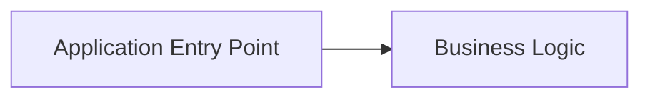
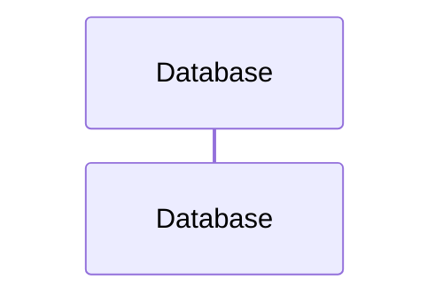
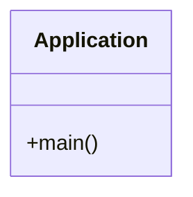

# Architecture Decision Record (ADR)

## 프로젝트: src

**생성일시:** 2026-02-25 08:16:37

**분석 도구:** ADR Generator v1.0

---

## 1. 📋 개요

본 문서는 소스코드 분석을 통해 자동으로 생성된 Architecture Decision Record입니다.

### 프로젝트 언어 구성

| 언어 | 파일 수 | 비율 |
|------|---------|------|
| Java | 35 | 100.0% |

### 프로젝트 통계

| 항목 | 수량 |
|------|------|
| 총 소스 파일 | 35 |
| 클래스/인터페이스/타입 | 37 |
| 패키지/네임스페이스/모듈 | 5 |
| 논리적 모듈 | 5 |
| API 엔드포인트 | 0 |
| 데이터베이스 테이블 | 8 |

## 2. 🎯 핵심 의사결정 (ADR-E)

### 의사결정

**결정:** Hibernate 기반 아키텍처 채택

**근거:** 장기적인 유지보수성, 확장성, 팀 협업을 위한 명확한 아키텍처 정의 필요

**영향받는 이해관계자:**
- 개발팀 - 구현 및 코드 작성
- 데이터팀 - 데이터베이스 관리
- 운영팀 - 배포 및 모니터링

## 3. 🔄 고려된 대안 (ADR-E)

### ✅ 선택된 옵션: Spring Boot

**설명:** 엔터프라이즈급 Java 프레임워크

**장점:**
- 성숙한 생태계와 풍부한 라이브러리
- 대규모 커뮤니티 지원
- 엔터프라이즈 기능 내장 (보안, 트랜잭션, 캐싱)
- Spring Data, Spring Security 등 통합 용이

**단점:**
- 상대적으로 무거운 메모리 사용
- 초기 학습 곡선
- 빌드 시간이 다소 길 수 있음

**선택 이유:** 팀의 기존 경험과 엔터프라이즈 요구사항에 가장 적합. 안정성과 생산성의 균형

### ❌ 거부된 대안들

#### Quarkus

**설명:** 클라우드 네이티브 Java 프레임워크

**장점:**
- 빠른 시작 시간 (밀리초 단위)
- 낮은 메모리 사용량
- 네이티브 이미지 컴파일 지원
- Kubernetes 최적화

**단점:**
- 상대적으로 작은 생태계
- 팀의 경험 부족
- 일부 레거시 라이브러리 호환성 문제

**거부 이유:** 클라우드 네이티브 장점은 있으나, 팀의 Spring 경험과 기존 라이브러리 활용을 우선시

#### Micronaut

**설명:** 마이크로서비스 중심 프레임워크

**장점:**
- 컴파일 타임 의존성 주입
- 빠른 시작 시간
- 낮은 메모리 사용

**단점:**
- Spring 대비 작은 생태계
- 학습 자료 부족
- 팀 경험 부족

**거부 이유:** 성능 이점은 있으나, 현재 프로젝트 규모에서는 Spring의 생산성이 더 중요

## 4. 📝 구조화된 설명 - 5W1H (ADR-E)

### 🤔 Why (왜)

**문제:** API 엔드포인트가 명시적으로 정의되지 않음. 명확한 디자인 패턴 없이 클래스 수가 증가.

**동기:** 장기적인 유지보수성, 확장성, 팀 협업을 위한 명확한 아키텍처 정의 필요

**목표:**
- 명확하고 추적 가능한 아키텍처 구조 확립
- 팀 간 일관된 이해와 커뮤니케이션 촉진
- 기술 부채 최소화 및 품질 속성 보장

### 📋 What (무엇을)

**결정 내용:** Hibernate 기반 아키텍처 채택

**범위:** 전체 프로젝트 (35개 파일, 37개 클래스)

### ⚖️ What-if (만약)

**트레이드오프:**
- 프레임워크 의존성 증가 vs 개발 생산성 향상
- 학습 곡선 vs 표준화된 패턴

**예상 결과:**
- 개발 생산성 향상
- 코드 품질 및 일관성 개선
- 유지보수 비용 감소

### 👥 Who (누가)

**의사결정자:** 아키텍처 팀 / 기술 리더

**영향받는 팀:**
- 개발팀 - 구현 및 코드 작성
- 데이터팀 - 데이터베이스 관리
- 운영팀 - 배포 및 모니터링

**책임자:** 아키텍처 팀

### 📍 Where (어디서)

**적용 범위:** 모듈: analyzer, generator, model, 외 2개

**경계:** 레거시 시스템과의 통합 인터페이스는 별도 검토 필요

### ⏰ When (언제)

**유효 기간:** 프로젝트 전체 생명주기 (단, 주요 기술 스택 변경 시 재검토)

**재검토 일정:** 분기별 아키텍처 리뷰 또는 주요 요구사항 변경 시

**의존성:**
- 선택된 프레임워크 버전 호환성

## 5. 🏗️ 아키텍처 결정사항

### 2.1 아키텍처 스타일

**결정:** 단순 구조 (Simple Structure)

**설명:** 명확한 아키텍처 패턴이 적용되지 않은 단순 구조입니다.

**고려사항:** 프로젝트 규모가 커질 경우 아키텍처 재설계 필요

### 2.2 계층 구조

**결정:** 단순 계층 구조 또는 미정의

**근거:** 소규모 프로젝트 또는 프로토타입 단계로 추정

## 6. 📦 모듈 구조

| 모듈명 | 패키지 | 클래스 수 |
|--------|---------|----------|
| analyzer | com.adr.analyzer | 1 |
| generator | com.adr.generator | 1 |
| model | com.adr.model | 1 |
| language | com.adr.analyzer.language | 1 |
| adr | com.adr | 1 |

## 7. 🛠️ 기술 스택

### 사용된 프레임워크 및 라이브러리

**데이터 접근**
- Hibernate
- Jakarta Persistence (JPA)
- Java Persistence (JPA)
- JDBC

**프레임워크**
- Spring MVC
- Spring Boot
- Spring Data
- Spring Framework
- Spring Service

**직렬화/JSON 처리**
- Gson
- Jackson

**기타**
- Apache Commons
- Java Servlet
- Jakarta Servlet
- Mockito
- SLF4J

**로깅**
- Java Util Logging
- Log4j

**테스팅**
- JUnit
- TestNG

## 8. 🎨 디자인 패턴

명확한 디자인 패턴이 감지되지 않았습니다.

## 9. 🗄️ 데이터베이스 설계

### 감지된 테이블

- Table: database_analyzer (JPA Entity)
- Table: java_script_analyzer (JPA Entity)
- Table: private (SQL DDL)
- Table: SQL (SQL DDL)
- Table: ... (JPA Entity)
- Table: ... (JPA Entity)
- Table: SQL (SQL DDL)
- Table: SQL (SQL DDL)

## 10. 🌐 API 설계

REST API 엔드포인트가 감지되지 않았습니다.

## 11. 📊 아키텍처 다이어그램

### 11.1 데이터 흐름도



### 11.2 모듈 구성도

```mermaid
graph TB
    %% Styling
    classDef core fill:#e1f5fe,stroke:#01579b,stroke-width:2px;
    classDef module fill:#ffffff,stroke:#333,stroke-width:1px;
    M0["analyzer<br/>(1 classes)"]::: module
    M1["generator<br/>(1 classes)"]::: module
    M2["model<br/>(1 classes)"]::: module
    M3["language<br/>(1 classes)"]::: module
    M4["adr<br/>(1 classes)"]::: module
    M0 --> M2
    M3 --> M2
    M1 --> M2
    M4 --> M0
    M4 --> M1
    M4 --> M2
```

### 11.3 논리적 시퀀스 다이어그램



### 11.4 주요 클래스 다이어그램



## 12. ⚠️ 아키텍처 위험 요소 및 권장사항

### 🔴 보안 취약점 가능성 [CRITICAL]

**설명:** 다음 보안 관련 이슈가 발견되었습니다:
- 입력 검증 라이브러리 또는 커스텀 검증 클래스가 감지되지 않음

**권장사항:** **보안 강화 권장사항:**

**1. 인증 및 인가**
- Spring Security - 포괄적인 보안 프레임워크
- JWT (JSON Web Token) - 토큰 기반 인증

**2. 입력 검증**
- 모든 사용자 입력 검증 필수
- SQL Injection, XSS 방어
- 화이트리스트 기반 검증 사용
- ZIP 파일 처리 시 Zip Slip / ZIP Bomb 방어 구현

**3. 보안 헤더**
- HTTPS 강제 사용
- CORS 정책 설정
- Content Security Policy (CSP) 적용

**4. 민감 정보 보호**
- 환경 변수로 비밀키 관리
- 암호화 저장 (bcrypt, Argon2)
- 로그에 민감 정보 노출 방지

### 🟠 데이터 접근 계층 미분리 [HIGH]

**설명:** 데이터베이스를 사용하지만 Repository 패턴이 감지되지 않았습니다. 비즈니스 로직과 데이터 접근 로직이 혼재되어 있을 가능성이 높습니다.

**권장사항:** **아키텍처 개선 가이드:**

**1. Repository 패턴 도입**
   - 데이터 접근 로직을 담당하는 별도 인터페이스/클래스 정의
   - 비즈니스 로직(Service)에서 데이터 소스의 세부 사항을 알지 못하게 분리

**2. 계층형 아키텍처 구성**
   - **Presentation:** 사용자 인터페이스/API 엔드포인트
   - **Service:** 비즈니스 규칙 및 유즈케이스 처리
   - **Repository:** 데이터 영속성 관리

**장점:**
- 테스트 용이성 (Mock/Stub 사용 가능)
- 데이터베이스 기술 변경 시 서비스 코드 수정 최소화
- 유지보수성 및 코드 가독성 향상

### 🟡 높은 의존성 복잡도 [MEDIUM]

**설명:** 프로젝트에 60개의 의존성이 발견되었습니다. 과도한 의존성은 유지보수를 어렵게 만들 수 있습니다.

**권장사항:** 의존성을 재검토하고 불필요한 의존성을 제거하세요. 의존성 역전 원칙(DIP)을 적용하여 결합도를 낮추세요.

### 🟡 과도한 프레임워크 사용 [MEDIUM]

**설명:** 20개의 서로 다른 프레임워크/라이브러리가 사용되고 있습니다. 이는 프로젝트의 복잡도를 증가시키고 유지보수를 어렵게 만들 수 있습니다.

**권장사항:** **즉시 조치:**
1. 사용 중인 프레임워크 목록을 검토하고 중복 기능 제공 여부 확인
2. 핵심 프레임워크로 통합 (예: 로깅은 하나의 프레임워크로 통일)
3. 사용하지 않는 의존성 제거

**장기 전략:**
- 새로운 프레임워크 도입 시 아키텍처 리뷰 필수화
- 프레임워크 선택 가이드라인 문서화

### 🟡 디자인 패턴 부재 [MEDIUM]

**설명:** 명확한 디자인 패턴이 감지되지 않았습니다. 코드 구조화가 부족할 수 있습니다.

**권장사항:** **즉시 적용 가능한 패턴:**

1. **Service Layer 패턴**
   - 비즈니스 로직을 별도 Service 클래스로 분리
   - 컨트롤러/UI와 데이터 접근 계층 사이의 중재자 역할
   - 예: `UserService`, `OrderService`

2. **Repository 패턴**
   - 데이터 접근 로직을 캡슐화
   - 비즈니스 로직과 데이터 소스 분리
   - 예: `UserRepository`, `ProductRepository`

3. **DTO (Data Transfer Object) 패턴**
   - 계층 간 데이터 전송용 객체
   - 도메인 모델과 API 응답 분리
   - 예: `UserDTO`, `CreateUserRequest`

**리팩토링 순서:**
1. 가장 복잡한 클래스부터 Service Layer 분리
2. 데이터 접근 코드를 Repository로 추출
3. API 경계에 DTO 도입
4. 단위 테스트 작성으로 리팩토링 검증

### 🟡 성능 최적화 필요 [MEDIUM]

**설명:** 다음 성능 관련 개선 사항이 발견되었습니다:
- ORM 사용 시 N+1 쿼리 문제 가능성

**권장사항:** **성능 최적화 권장사항:**

**1. 캐싱 전략**
- **애플리케이션 레벨 캐싱**: Redis, Memcached
- **HTTP 캐싱**: ETag, Cache-Control 헤더
- **데이터베이스 쿼리 캐싱**: 자주 조회되는 데이터

**2. 데이터베이스 최적화**
- 인덱스 추가 (자주 조회되는 컬럼)
- N+1 쿼리 문제 해결 (Eager Loading, Batch Fetching)
- 쿼리 실행 계획 분석 및 최적화
- 커넥션 풀 설정 최적화

**3. API 성능**
- 페이지네이션 구현 (대량 데이터)
- 응답 압축 (gzip)
- 비동기 처리 (무거운 작업)

**4. 모니터링**
- APM 도구 도입 (Application Performance Monitoring)
- 느린 쿼리 로깅
- 성능 메트릭 수집 및 분석

### 🟡 코드 품질 관리 필요 [MEDIUM]

**설명:** 다음 코드 품질 관련 개선 사항이 발견되었습니다:
- 정적 분석 도구 미사용

**권장사항:** **코드 품질 개선 권장사항:**

**1. 정적 분석 도구 도입**

**Java:**
- **Checkstyle** - 코딩 스타일 검사
- **PMD** - 잠재적 버그 탐지
- **SpotBugs** - 버그 패턴 분석
- **SonarQube** - 종합 코드 품질 분석

**2. 코드 리뷰 프로세스**
- Pull Request 필수화
- 최소 1명 이상의 리뷰어 승인
- 자동화된 CI 체크 통과 필수

**3. 코드 메트릭 모니터링**
- 순환 복잡도 (Cyclomatic Complexity) < 10
- 메서드 길이 < 50줄
- 클래스 크기 < 500줄

**4. 리팩토링 원칙**
- SOLID 원칙 준수
- DRY (Don't Repeat Yourself)
- KISS (Keep It Simple, Stupid)
- YAGNI (You Aren't Gonna Need It)

### 🟢 API 엔드포인트 미발견 [LOW]

**설명:** Spring MVC를 사용하지만 API 엔드포인트가 감지되지 않았습니다.

**권장사항:** REST API 설계를 검토하세요.

### 🟢 코드 문서화 권장 [LOW]

**설명:** 프로젝트 규모가 커질수록 코드 주석 및 문서화가 중요합니다. 특히 복잡한 비즈니스 로직이나 알고리즘은 반드시 문서화해야 합니다.

**권장사항:** **코드 문서화 가이드:**

1. **클래스 수준 문서화**
   - 클래스의 목적과 책임 설명
   - 주요 사용 사례

2. **메서드 문서화**
   - 파라미터 설명
   - 반환값 설명
   - 예외 상황

3. **복잡한 로직**
   - 알고리즘 설명
   - 왜 이렇게 구현했는지 (Why)

4. **README 작성**
   - 프로젝트 개요
   - 설치 및 실행 방법
   - 아키텍처 다이어그램

## 13. 📝 결론

본 프로젝트는 **1개의 심각한 아키텍처 위험 요소**를 포함하고 있습니다. 즉각적인 개선이 필요합니다.

### 다음 단계

1. 위험 요소 검토 및 우선순위 결정
2. 개선 계획 수립
3. 점진적 리팩토링 실행
4. 정기적인 아키텍처 리뷰

---

*본 문서는 ADR Generator에 의해 자동 생성되었습니다.*
