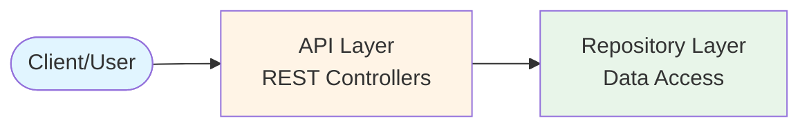
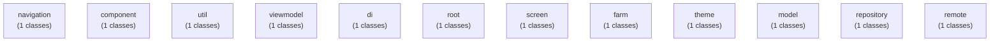
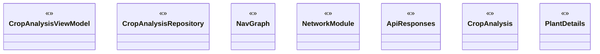

# Architecture Decision Record (ADR)

## 프로젝트: adr-analysis-8270021055639209499

**생성일시:** 2026-02-19 19:06:46

**분석 도구:** ADR Generator v1.0

---

## 1. 📋 개요

본 문서는 소스코드 분석을 통해 자동으로 생성된 Architecture Decision Record입니다.

### 프로젝트 언어 구성

| 언어 | 파일 수 | 비율 |
|------|---------|------|
| Kotlin | 30 | 100.0% |

### 프로젝트 통계

| 항목 | 수량 |
|------|------|
| 총 소스 파일 | 30 |
| 클래스/인터페이스/타입 | 69 |
| 패키지/네임스페이스/모듈 | 12 |
| 논리적 모듈 | 12 |
| API 엔드포인트 | 7 |
| 데이터베이스 테이블 | 0 |

## 2. 🎯 핵심 의사결정 (ADR-E)

### 의사결정

**결정:** RESTful API 중심 Retrofit 기반 아키텍처 채택

**근거:** 장기적인 유지보수성, 확장성, 팀 협업을 위한 명확한 아키텍처 정의 필요

**영향받는 이해관계자:**
- 개발팀 - 구현 및 코드 작성
- 프론트엔드팀 - API 통합
- 운영팀 - 배포 및 모니터링

## 3. 🔄 고려된 대안 (ADR-E)

### ✅ 선택된 옵션: Kotlin Coroutines

**설명:** Kotlin 비동기 처리 표준 방식

**장점:**
- suspend/async 로 직관적 비동기 코드
- Spring, Ktor 모두 네이티브 지원
- 구조적 동시성으로 안전한 취소

**단점:**
- RxJava 마이그레이션 시 러닝 커브

**선택 이유:** Kotlin 프로젝트라면 코루틴이 사실상 표준

### ❌ 거부된 대안들

#### Spring WebFlux / Project Reactor

**설명:** Spring 리액티브 스택

**장점:**
- 백프레셔 지원
- R2DBC로 완전 논블로킹 DB 처리
- Spring 생태계 그대로 활용

**단점:**
- Coroutine보다 복잡한 체인 디버깅
- 함수형 스타일 강제

**거부 이유:** 기존 R2DBC 기반 프로젝트에 적합

#### GraphQL

**설명:** 쿼리 언어 기반 API

**장점:**
- 정확한 데이터 요청
- 단일 엔드포인트
- 강력한 타입 시스템

**단점:**
- 복잡도 증가
- 캐싱 어려움
- 학습 곡선

**거부 이유:** 현재 요구사항에서는 REST의 단순함이 더 적합

## 4. 📝 구조화된 설명 - 5W1H (ADR-E)

### 🤔 Why (왜)

**문제:** 데이터 영속성 전략이 불명확.

**동기:** 장기적인 유지보수성, 확장성, 팀 협업을 위한 명확한 아키텍처 정의 필요

**목표:**
- 명확하고 추적 가능한 아키텍처 구조 확립
- 팀 간 일관된 이해와 커뮤니케이션 촉진
- 기술 부채 최소화 및 품질 속성 보장

### 📋 What (무엇을)

**결정 내용:** RESTful API 중심 Retrofit 기반 아키텍처 채택

**범위:** 전체 프로젝트 (30개 파일, 69개 클래스)

### ⚖️ What-if (만약)

**트레이드오프:**
- 프레임워크 의존성 증가 vs 개발 생산성 향상
- 학습 곡선 vs 표준화된 패턴

**예상 결과:**
- 개발 생산성 향상
- 코드 품질 및 일관성 개선
- 유지보수 비용 감소

### 👥 Who (누가)

**의사결정자:** 아키텍처 팀 / 기술 리더

**영향받는 팀:**
- 개발팀 - 구현 및 코드 작성
- 프론트엔드팀 - API 통합
- 운영팀 - 배포 및 모니터링

**책임자:** 아키텍처 팀

### 📍 Where (어디서)

**적용 범위:** 모듈: navigation, component, util, 외 9개

**경계:** 레거시 시스템과의 통합 인터페이스는 별도 검토 필요

### ⏰ When (언제)

**유효 기간:** 프로젝트 전체 생명주기 (단, 주요 기술 스택 변경 시 재검토)

**재검토 일정:** 분기별 아키텍처 리뷰 또는 주요 요구사항 변경 시

**의존성:**
- 선택된 프레임워크 버전 호환성

## 5. 🏗️ 아키텍처 결정사항

### 2.1 아키텍처 스타일

**결정:** RESTful API 기반 아키텍처

**설명:** HTTP 프로토콜을 통한 RESTful API를 제공하는 아키텍처입니다.

**장점:** 클라이언트-서버 분리, 확장성, 플랫폼 독립성

**고려사항:** API 버저닝, 인증/인가, 에러 핸들링

### 2.2 계층 구조

**결정:** 단순 계층 구조 또는 미정의

**근거:** 소규모 프로젝트 또는 프로토타입 단계로 추정

## 6. 📦 모듈 구조

| 모듈명 | 패키지 | 클래스 수 |
|--------|---------|----------|
| navigation | com.example.farm.ui.navigation | 1 |
| component | com.example.farm.ui.component | 1 |
| util | com.example.farm.ui.util | 1 |
| viewmodel | com.example.farm.ui.viewmodel | 1 |
| di | com.example.farm.di | 1 |
| root | root | 1 |
| screen | com.example.farm.ui.screen | 1 |
| farm | com.example.farm | 1 |
| theme | com.example.farm.ui.theme | 1 |
| model | com.example.farm.data.model | 1 |
| repository | com.example.farm.data.repository | 1 |
| remote | com.example.farm.data.remote | 1 |

## 7. 🛠️ 기술 스택

### 사용된 프레임워크 및 라이브러리

**기타**
- Retrofit
- OkHttp
- Android Jetpack
- Jetpack Compose
- Android Architecture Components
- Kotlin Coroutines
- Gradle Kotlin DSL
- Dagger/Hilt (DI)

**테스팅**
- JUnit

**직렬화/JSON 처리**
- Gson

## 8. 🎨 디자인 패턴

### ViewModel (MVVM)

**적용된 클래스:**
- `CropAnalysisViewModel`

**목적:** ViewModel (MVVM) 패턴 적용

### Repository

**적용된 클래스:**
- `CropAnalysisRepository`

**목적:** 데이터 접근 로직을 캡슐화하여 비즈니스 로직과 분리

### Sealed Class (ADT)

**적용된 클래스:**
- `NavGraph`
- `CropAnalysisViewModel`

**목적:** Sealed Class (ADT) 패턴 적용

### Builder

**적용된 클래스:**
- `NetworkModule`

**목적:** 복잡한 객체의 생성 과정을 단계별로 구성

### DTO/Data class

**적용된 클래스:**
- `ApiResponses`
- `CropAnalysis`
- `PlantDetails`
- `PlantInfoSections`
- `TrefleResponse`
- `GeminiApi`
- `OpenAIApi`
- `WikipediaApi`
- `CropAnalysisViewModel`

**목적:** DTO/Data class 패턴 적용

## 9. 🗄️ 데이터베이스 설계

데이터베이스 스키마가 감지되지 않았습니다.

## 10. 🌐 API 설계

### API 엔드포인트

| HTTP Method | Endpoint | Handler |
|-------------|----------|----------|
| POST | v2/identify | (Retrofit) |
| GET | plants | (Retrofit) |
| GET | plants/{id} | (Retrofit) |
| GET | weather | (Retrofit) |
| POST | v1beta/models/gemini-1.5-flash:generateContent | (Retrofit) |
| POST | v1/chat/completions | (Retrofit) |
| GET | page/summary/{title} | (Retrofit) |

## 11. 📊 아키텍처 다이어그램

### 8.1 데이터 흐름도

### 8.2 모듈 구성도

### 8.3 주요 클래스 다이어그램

## 12. ⚠️ 아키텍처 위험 요소 및 권장사항

### 🔴 보안 취약점 가능성 [CRITICAL]

**설명:** 다음 보안 관련 이슈가 발견되었습니다:
- API 엔드포인트가 있지만 인증/인가 프레임워크가 감지되지 않음
- 입력 검증 라이브러리 또는 커스텀 검증 클래스가 감지되지 않음

**권장사항:** **보안 강화 권장사항:**

**1. 인증 및 인가**

**2. 입력 검증**
- 모든 사용자 입력 검증 필수
- SQL Injection, XSS 방어
- 화이트리스트 기반 검증 사용
- ZIP 파일 처리 시 Zip Slip / ZIP Bomb 방어 구현

**3. 보안 헤더**
- HTTPS 강제 사용
- CORS 정책 설정
- Content Security Policy (CSP) 적용

**4. 민감 정보 보호**
- 환경 변수로 비밀키 관리
- 암호화 저장 (bcrypt, Argon2)
- 로그에 민감 정보 노출 방지

### 🟡 높은 의존성 복잡도 [MEDIUM]

**설명:** 프로젝트에 207개의 의존성이 발견되었습니다. 과도한 의존성은 유지보수를 어렵게 만들 수 있습니다.

**권장사항:** 의존성을 재검토하고 불필요한 의존성을 제거하세요. 의존성 역전 원칙(DIP)을 적용하여 결합도를 낮추세요.

### 🟡 API 문서화 부족 [MEDIUM]

**설명:** 프로젝트에 7개의 API 엔드포인트가 있지만 자동 문서화 도구가 감지되지 않았습니다. API 문서가 없으면 프론트엔드 개발자 및 외부 사용자가 API를 이해하기 어렵습니다.

**권장사항:** **API 문서화 권장사항:**

**문서화 모범 사례:**
1. 모든 API 엔드포인트에 설명 추가
2. 요청/응답 예제 제공
3. 에러 코드 및 처리 방법 문서화
4. 인증 방법 명시
5. 버전 정보 포함

### 🟡 코드 품질 관리 필요 [MEDIUM]

**설명:** 다음 코드 품질 관련 개선 사항이 발견되었습니다:
- 정적 분석 도구 미사용

**권장사항:** **코드 품질 개선 권장사항:**

**1. 정적 분석 도구 도입**

**2. 코드 리뷰 프로세스**
- Pull Request 필수화
- 최소 1명 이상의 리뷰어 승인
- 자동화된 CI 체크 통과 필수

**3. 코드 메트릭 모니터링**
- 순환 복잡도 (Cyclomatic Complexity) < 10
- 메서드 길이 < 50줄
- 클래스 크기 < 500줄

**4. 리팩토링 원칙**
- SOLID 원칙 준수
- DRY (Don't Repeat Yourself)
- KISS (Keep It Simple, Stupid)
- YAGNI (You Aren't Gonna Need It)

### 🟢 코드 문서화 권장 [LOW]

**설명:** 프로젝트 규모가 커질수록 코드 주석 및 문서화가 중요합니다. 특히 복잡한 비즈니스 로직이나 알고리즘은 반드시 문서화해야 합니다.

**권장사항:** **코드 문서화 가이드:**

1. **클래스 수준 문서화**
   - 클래스의 목적과 책임 설명
   - 주요 사용 사례

2. **메서드 문서화**
   - 파라미터 설명
   - 반환값 설명
   - 예외 상황

3. **복잡한 로직**
   - 알고리즘 설명
   - 왜 이렇게 구현했는지 (Why)

4. **README 작성**
   - 프로젝트 개요
   - 설치 및 실행 방법
   - 아키텍처 다이어그램

## 13. 📝 결론

본 프로젝트는 **1개의 심각한 아키텍처 위험 요소**를 포함하고 있습니다. 즉각적인 개선이 필요합니다.

### 다음 단계

1. 위험 요소 검토 및 우선순위 결정
2. 개선 계획 수립
3. 점진적 리팩토링 실행
4. 정기적인 아키텍처 리뷰

---

*본 문서는 ADR Generator에 의해 자동 생성되었습니다.*
